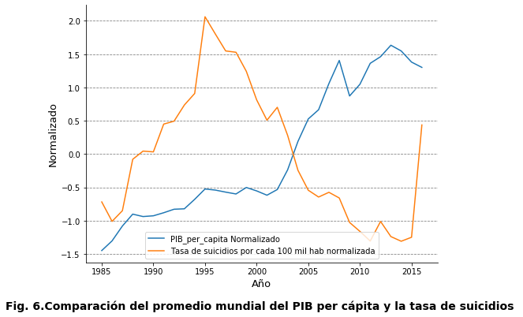

# Análisis de clasificación de las tasas de suicidio
## Material para el taller de analis de datos

En este trabajo se procedera a la clasificación y predicción de los grupos con alto riesgo de suicidio.
Por lo tanto, este análisis tiene como objetivo investigar si varias características como la edad, el sexo, la población, etc. 
Tienen poder de clasificación para identificar grupos de alto riesgo, esto es importante para poder prevenir suicidios y crear planes de contingencia 
conociendo a que grupos intervenir más.

Este es un análisis didáctico llevado a cabo en el taller de *Análisis de datos de la USFQ*, por Cristhian Ortiz 
Se uso el set de datos "Resumen de tasas de suicidios de 1985 a 2016" de Kaggle

